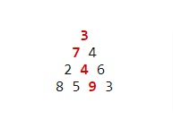
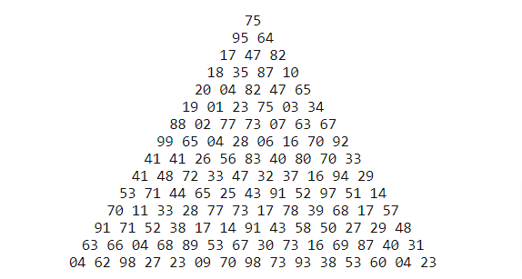

# Problem #18: Maximum path sum I
By starting at the top of the triangle below and moving to adjacent numbers on the row below, the maximum total from top to bottom is 23.

That is, 3 + 7 + 4 + 9 = 23.

Find the maximum total from top to bottom of the triangle below:

**NOTE:** As there are only 16384 routes, it is possible to solve this problem by trying every route. However, Problem 67, is the same challenge with a triangle containing one-hundred rows; it cannot be solved by brute force, and requires a clever method! ;o)